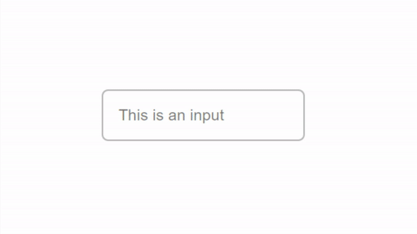

# Input
(inspired by Googles Material Design)  
demo: [tim-greller.tk/fl-elements/inpt](http://tim-greller.tk/fl-elements/inpt)  

## How to use
1. Include the stylesheet:
```<link rel="stylesheet" href="input.css">```
2. Create an input with a custom label:
```
<div class="input">
    <input type="text" required/>
    <label>This is an input</label>
</div>
```
3. You can now adjust width, height, padding, border and margin of the input-div.

<br> 


